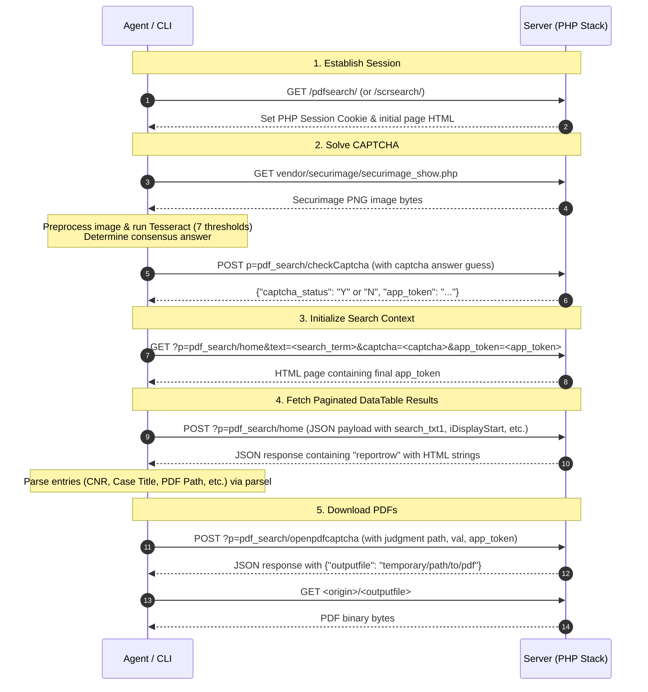
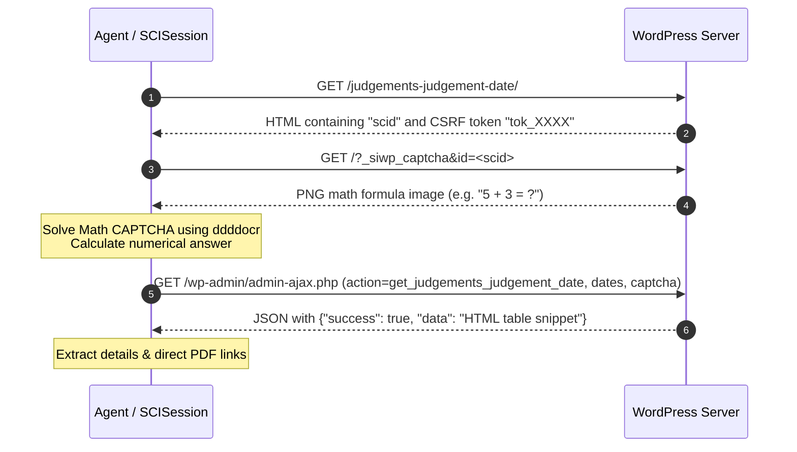

# LLM Agent Guide — srchigh repository

Welcome, LLM/Agent! This document provides a comprehensive technical guide to the **srchigh** repository, designed to get you up-to-speed immediately. Use this to understand the codebase structure, request flows, captcha bypass strategies, database schemas, and testing pipelines.

---

## 1. Repository Purpose & Scope

The **srchigh** package is a Python command-line utility for searching, metadata exporting, and downloading PDF judgments from three Indian judicial portals:
1. **eCourts High Courts** ([eCourts PDF Search](https://judgments.ecourts.gov.in/pdfsearch/))
2. **Supreme Court Reports (SCR)** ([SCR Search](https://scr.sci.gov.in/scrsearch/))
3. **Supreme Court of India (SCI) Judgment Date Portal** ([SCI Judgment Date](https://www.sci.gov.in/judgements-judgement-date/))

The core challenge of this codebase is **bypassing anti-bot features**, specifically solving alphanumeric/mathematical CAPTCHAs, maintaining CSRF token chains (`app_token`), parsing server-side rendered HTML, and rotating sessions to avoid rate-limiting.

---

## 2. Directory & Module Reference

Here are the primary components of the project:

- [pyproject.toml](file:///Users/ck/srchigh/pyproject.toml): Defines metadata and package dependencies:
  - `httpx`: For asynchronous HTTP calls.
  - `aiosqlite`: Persist parsed case metadata.
  - `Pillow` & `pytesseract`: Alphanumeric CAPTCHA image preprocessing and OCR.
  - `ddddocr`: Machine-learning OCR for math CAPTCHAs.
  - `parsel`: CSS selector extraction of DataTable responses.
  - `tqdm`: Interactive CLI download progress bar.
- [main.py](file:///Users/ck/srchigh/main.py): Convenience wrapper to run the app directly via `python3 main.py`.
- [src/srchigh/main.py](file:///Users/ck/srchigh/src/srchigh/main.py): CLI entry point, argument parsing (`parse_args`), and orchestration of search, SCI, and database downloading workflows.
- [src/srchigh/config.py](file:///Users/ck/srchigh/src/srchigh/config.py): Constants, state/court mapping dicts ([COURT_CODES](file:///Users/ck/srchigh/src/srchigh/config.py#L27-L35)), first-run detection, configuration storage paths (`~/.config/srchigh/`), and config file validation.
- [src/srchigh/session.py](file:///Users/ck/srchigh/src/srchigh/session.py): Defines [ECourtSession](file:///Users/ck/srchigh/src/srchigh/session.py#L44), which coordinates async sessions, alphanumeric CAPTCHA solving, and relative/absolute PDF URL retrieval for eCourts and SCR.
- [src/srchigh/sci.py](file:///Users/ck/srchigh/src/srchigh/sci.py): Defines [SCISession](file:///Users/ck/srchigh/src/srchigh/sci.py#L92), which solves math CAPTCHAs and splits queries into 30-day chunks (the server's strict limit).
- [src/srchigh/parser.py](file:///Users/ck/srchigh/src/srchigh/parser.py): Selects and cleans DataTable fields from raw HTML inputs. Highlights:
  - [parse_entry](file:///Users/ck/srchigh/src/srchigh/parser.py#L10): Parses a single result row using CSS/XPath.
  - [parse_results_page](file:///Users/ck/srchigh/src/srchigh/parser.py#L93): Extracts all rows from the DataTable JSON.
- [src/srchigh/db.py](file:///Users/ck/srchigh/src/srchigh/db.py): Async SQLite database interface using `aiosqlite`. Manages the local persistent store located at `~/.config/srchigh/judgments.db`.
- [src/srchigh/download.py](file:///Users/ck/srchigh/src/srchigh/download.py): Concurrent batch downloader using asyncio Semaphores and automated session rotation.
- [src/srchigh/export.py](file:///Users/ck/srchigh/src/srchigh/export.py): Utility functions for writing and parsing `_results.csv` files.
- [src/srchigh/log_setup.py](file:///Users/ck/srchigh/src/srchigh/log_setup.py): Custom log formatting that prints ASCII-visualized CAPTCHAs when in verbose mode.

---

## 3. High Courts & SCR Architectural Flow (eCourts / SCR)

The eCourts and SCR portals are PHP applications relying on server-side paginated DataTables. 



### Key Technical Insights (eCourts/SCR):
- **Search parameter trick:** The main text field `search_txt` is ignored by the server. Instead, search terms must be submitted via **`search_txt1`** (a "search within results" Full-Text Search input). The CLI handles this mapping automatically.
- **`app_token` state:** Every response containing JSON updates the `app_token` (CSRF token). If the chain is broken, requests fail with a `403` or empty responses. The [ECourtSession](file:///Users/ck/srchigh/src/srchigh/session.py#L44) object manages this token mutation in `self.app_token`.
- **Session Rotation:** When retrieving heavy PDF datasets, the server actively throttles/blocks sessions. The downloader rotates the underlying session every **20 PDF downloads** by clearing cookies and re-solving a fresh CAPTCHA.

---

## 4. SCI Portal Flow (Supreme Court of India)

The SCI Judgment Date portal differs architecturally. It uses WordPress with a math-based CAPTCHA plugin (`securimage-wp`). It restricts queries to **date ranges of at most 30 days**.



### Key Technical Insights (SCI):
- **Date Chunking:** To query wide date ranges (e.g. an entire year), the `run_sci_search` orchestration function splits dates into 30-day blocks via [_split_date_range](file:///Users/ck/srchigh/src/srchigh/sci.py#L44) and fetches them sequentially.
- **Math Solver Fallback:** Math characters are often misidentified. [_solve_math_captcha](file:///Users/ck/srchigh/src/srchigh/sci.py#L131) in `sci.py` extracts the digits, validates that they are in the `[1, 10]` range, and implements a random guess fallback (`+` or `-`) if the operator is unrecognized, achieving high success rates upon retry.

---

## 5. CAPTCHA Solving Internals

### Alphanumeric (eCourts/SCR) — [ECourtSession.solve_captcha](file:///Users/ck/srchigh/src/srchigh/session.py#L91)
1. **Grayscale conversion** removes colorful noise.
2. **Upscaling & Filtering:** Resizes the image 2x and applies a Median filter.
3. **Multi-threshold Binarization:** Applies 7 threshold values (`110, 120, 130, 140, 150, 160, 170`).
4. **Tesseract OCR:** Invokes pytesseract on each threshold variant with `--psm 8` (single word config) and character whitelisting.
5. **Consensus Sorting:** Votes on the binarized guesses. The most common guess of valid length (4-6 chars) is validated first.
6. **Server Check:** Iteratively posts guesses to `checkCaptcha` until one returns `"Y"`. Retries up to 30 times (clearing cookies every 5 failures).

### Math (SCI) — [SCISession.solve_captcha](file:///Users/ck/srchigh/src/srchigh/sci.py#L170)
1. Direct buffer processing using `ddddocr` (a neural-network based OCR engine).
2. Computed verification of the resulting equation string.

---

## 6. Database Persistance Schema

SQLite persistence is implemented in [src/srchigh/db.py](file:///Users/ck/srchigh/src/srchigh/db.py). There are three tables:

### 1. `judgments`
Stores metadata and download states of scraped court judgments.
```sql
CREATE TABLE IF NOT EXISTS judgments (
    id              INTEGER PRIMARY KEY AUTOINCREMENT,
    cnr             TEXT,              -- Case Number (or sanitized citation for SCR)
    case_title      TEXT,              -- e.g. "APPLN/4098/2025..."
    court           TEXT,              -- e.g. "Bombay High Court"
    judge           TEXT,              -- Presiding judge(s)
    reg_date        TEXT,              -- DD-MM-YYYY format
    decision_date   TEXT,              -- DD-MM-YYYY format
    disposal_nature TEXT,              -- Disposal nature string
    pdf_path        TEXT,              -- Relative server path to PDF
    search_term     TEXT,              -- The query term used
    source          TEXT DEFAULT 'ecourts', -- 'ecourts', 'scr', or 'sci'
    downloaded      INTEGER DEFAULT 0, -- 1 = downloaded, 0 = pending
    file_size       INTEGER DEFAULT 0, -- Size in bytes
    created_at      TEXT,              -- ISO timestamp
    UNIQUE(cnr, search_term)
)
```

### 2. `searches`
Tracks metadata for completed search operations.
```sql
CREATE TABLE IF NOT EXISTS searches (
    id              INTEGER PRIMARY KEY AUTOINCREMENT,
    search_term     TEXT UNIQUE,
    mode            TEXT,
    court           TEXT,
    total_results   INTEGER DEFAULT 0,
    pages_fetched   INTEGER DEFAULT 0,
    created_at      TEXT
)
```

### 3. `download_log`
Chronological log of PDF retrieval successes and failures.
```sql
CREATE TABLE IF NOT EXISTS download_log (
    id              INTEGER PRIMARY KEY AUTOINCREMENT,
    cnr             TEXT,
    pdf_path        TEXT,
    search_term     TEXT,
    downloaded_at   TEXT,
    success         INTEGER,
    file_size       INTEGER,
    session_cnr     TEXT
)
```

---

## 7. Testing Pipeline

Test files are located in the [tests/](file:///Users/ck/srchigh/tests) directory. We run them with `pytest`.

```bash
# Run unit and smoke tests (safe offline)
python3 -m pytest tests/test_config.py tests/test_parser.py tests/test_export.py tests/test_smoke.py -v

# Run integration tests (Requires network access and Tesseract installed)
python3 -m pytest tests/test_session.py -v --network
```

- [tests/test_config.py](file:///Users/ck/srchigh/tests/test_config.py): Validates court name to numeric code translation.
- [tests/test_parser.py](file:///Users/ck/srchigh/tests/test_parser.py): Validates the parsel HTML parser against fixture files and raw html fragments.
- [tests/test_export.py](file:///Users/ck/srchigh/tests/test_export.py): Validates database integration, batch insertions, CSV exporters, and statistics collection.
- [tests/test_session.py](file:///Users/ck/srchigh/tests/test_session.py): Covers end-to-end integration tests that hit the active eCourts server. Only run when `--network` is supplied to pytest.
- [tests/test_smoke.py](file:///Users/ck/srchigh/tests/test_smoke.py): Verifies argument-parsing logic, edge cases, and CLI defaults.

---

## 8. Common Agent Workflows & Command Quick Reference

### Command Syntax

```bash
# Standard keyword query (Downloads 5 PDFs from High Courts)
python3 main.py "divorce" 5

# Search specifically on Supreme Court Reports (SCR)
python3 main.py "divorce" 5 --scr

# Search Supreme Court Judgments by Date Range
python3 main.py --sci --from 01-01-2024 --to 15-01-2024

# Extract metadata for ALL records to CSV (Skip download)
python3 main.py "divorce" --court bombay --all --csv --no-download

# Download pending PDFs based on previously stored database items
python3 main.py --download-db

# Check DB status counts
python3 main.py --status
```

---

## 9. Important Implementation Details

- **User Agent & TLS Fingerprinting:** When modifying HTTP headers in `session.py` or `sci.py`, ensure they reflect modern Chrome browser properties. The target web servers block standard Python `urllib` or `requests` defaults immediately.
- **Tesseract Pathing:** Tesseract is expected to be available on the user's `$PATH`. If `shutil.which("tesseract")` returns `None`, captcha resolution falls back to warnings.
- **Database Location:** Always check `~/.config/srchigh/judgments.db` for the active local database file. Don't write databases in temp directories.
